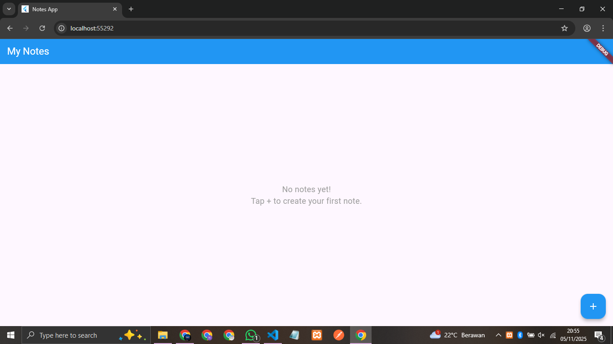
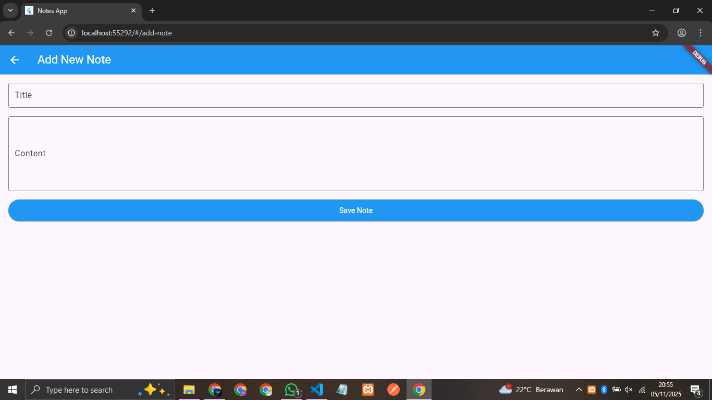

# Flutter Notes App

Aplikasi catatan sederhana built dengan Flutter dan Dart.

## 🚀 Fitur
- ✅ Create, Read, Update, Delete Notes
- ✅ State Management dengan Provider
- ✅ Navigasi antara halaman
- ✅ Stateless & Stateful Widgets
- ✅ Responsive UI

## 👥 Anggota Kelompok
- Bunga Clara October - UI Layer & Presentasi
- Erinna Dian Kristianti - State Management & Business Logic

## 🛠️ Teknologi
- Flutter 3.x
- Dart
- Provider (State Management)
- Material Design

## 📸 Screenshots



## 🏃‍♂️ Menjalankan Aplikasi
```bash
flutter pub get
flutter run
```

## 📁 Struktur Project
```
lib/
├── main.dart
├── models/
│   └── note_model.dart
├── providers/
│   └── note_provider.dart
├── pages/
│   ├── home_page.dart
│   └── add_note_page.dart
└── widgets/
    └── note_card.dart
```
=======
# notes-app-flutter
